## Using Azure Arc to deliver Extended Security Updates for Windows Server and SQL Server 2012

The following Jumpstart scenario will guide you on how to use Azure Arc to enroll Windows Server and SQL Server 2012/2012 R2 machines in [Extented Security Updates (ESUs)](https://learn.microsoft.com/windows-server/get-started/extended-security-updates-overview). This scenario creates an Azure VM with Hyper-V installed where the Windows Server and/or SQL Server VMs will run and will be onboard as Azure Arc-enabled server and/or Azure Arc-enabled SQL Server respectively. Once these VMs are registered in Azure you will have visibility into their ESU coverage and can enroll them through the Azure portal one month before Windows Server 2012 end of support.
In this scenario you can choose between working with Windows Server 2012 R2, SQL Server 2012 Standard edition or both.

**NOTE: In this scenario, ESU licenses are not provided or created, and will require you to provision them separately. The scenario will however create Windows Server 2012 R2 and/or SQL Server 2012 (Standard) machines that are connected to Azure Arc that you will be able to enroll on Extended Security Updates via the Azure portal and get billed monthly via your Azure subscription.**

## Prerequisites

- [Install or update Azure CLI](https://docs.microsoft.com/cli/azure/install-azure-cli?view=azure-cli-latest). Azure CLI should be running version 2.49.0 or later. Use ```az --version``` to check your current installed version.

- Create Azure service principal (SP)

    To connect a VM or bare-metal server to Azure Arc, Azure service principal assigned with the "Contributor" role is required. To create it, login to your Azure account run the below command (this can also be done in [Azure Cloud Shell](https://shell.azure.com/)).

    ```shell
    az login
    subscriptionId=$(az account show --query id --output tsv)
    az ad sp create-for-rbac -n "<Unique SP Name>" --role "Contributor" --scopes /subscriptions/$subscriptionId
    ```

    For example:

    ```shell
    az login
    subscriptionId=$(az account show --query id --output tsv)
    az ad sp create-for-rbac -n "JumpstartArc" --role "Contributor" --scopes /subscriptions/$subscriptionId
    ```

    Output should look like this:

    ```json
    {
    "appId": "XXXXXXXXXXXXXXXXXXXXXXXXXXXX",
    "displayName": "JumpstartArc",
    "password": "XXXXXXXXXXXXXXXXXXXXXXXXXXXX",
    "tenant": "XXXXXXXXXXXXXXXXXXXXXXXXXXXX"
    }
    ```

    > **NOTE: If you create multiple subsequent role assignments on the same service principal, your client secret (password) will be destroyed and recreated each time. Therefore, make sure you grab the correct password**.

    > **NOTE: The Jumpstart scenarios are designed with as much ease of use in-mind and adhering to security-related best practices whenever possible. It is optional but highly recommended to scope the service principal to a specific [Azure subscription and resource group](https://docs.microsoft.com/cli/azure/ad/sp?view=azure-cli-latest) as well considering using a [less privileged service principal account](https://docs.microsoft.com/azure/role-based-access-control/best-practices)**

## Deployment Options and Automation Flow

For you to get familiar with the automation and deployment flow, below is an explanation.

- User provides the Bicep template parameter values, either via the portal or editing the parameters file. These parameters values are used throughout the deployment.

- User will run the Bicep template at resource group level.

- User logs in to the Azure VM using Azure Bastion or RDP to trigger the Logon script. The script will:
  - Install Hyper-V
  - Create Windows and/or SQL VMs in Hyper-V
  - Onboard the Hyper-V VMs as Arc-enabled resources

## Bicep template deployment

- Clone the Azure Arc Jumpstart repository

    ```shell
    git clone https://github.com/microsoft/azure_arc.git
    ```

- Edit the parameter file to match your environment. You will need to provide:
  - _`spnClientId`_: the AppId of the service principal you created before.
  - _`spnClientSecret`_the password of the service principal you created before.
  - _`spnTenantId`_: your Azure AD's tenant ID.
  - _`windowsAdminUsername`_: Windows admin username for your Azure VM.
  - _`windowsAdminPassword`_: password for the Windows admin username.
  - _`deployBastion`_: whether or not you'd like to deploy Azure Bastion to access the Azure VM. Values can be "true" or "false"
  - _`esu`_: this parameter will allow you to control what VMs will be deployed. It can be`_:
    - _`ws`_: to only deploy a Windows Server 2012 R2 VM that will be registered as an Arc-enabled server.
    - _`sql`_: to only deploy a SQL Server 2012 Standard Edition VM that will be registered as an Arc-enabled SQL Server.
    - _`both`_: to deploy both a Windows Server 2012 R2 VM and a SQL Server 2012 Standard Edition VM that will be Arc-enabled.

  

- To run the automation, navigate to the [deployment folder](https://github.com/microsoft/azure_arc/tree/main/azure_arc_servers_jumpstart/esu/bicep). From the deployment folder run the below command:

  ```shell
    az group create --name "<resource-group-name>"  --location "<preferred-location>"
    az deployment group create -g "<resource-group-name>" \
    -f "main.bicep" -p "main.parameters.json"
  ```

    For example:

  ```shell
    az group create --name Arc-ESU-Demo --location "westeurope"
    az deployment group create --resource-group Arc-ESU-Demo \
    --name Arc-ESU-Demo --template-file main.bicep \
    --parameters main.parameters.json
  ```

- Once the automation finishes its run, you should see an output as follows:

  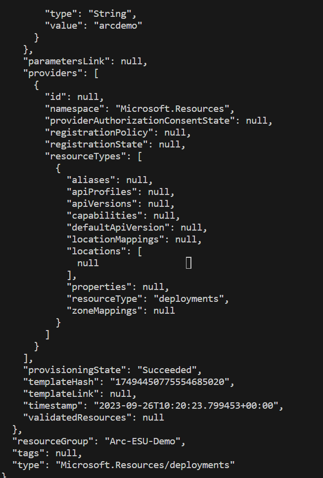

- After the script has finished its run verify the resources are created on the Azure Portal:

    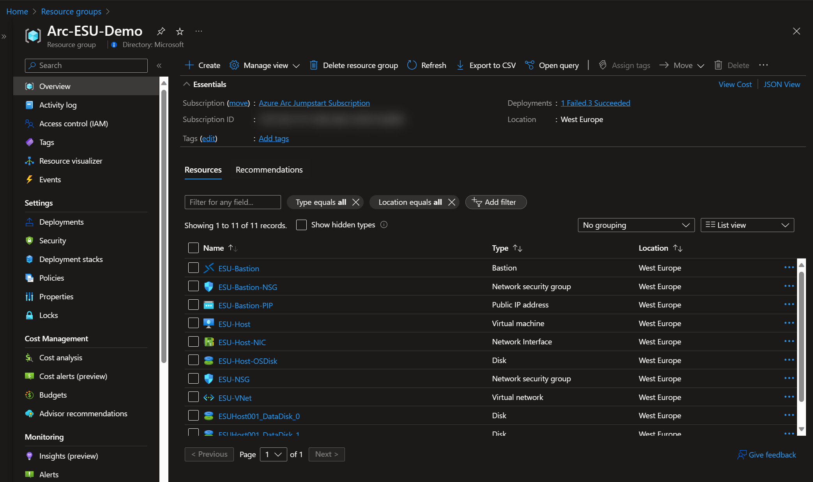

    

## Windows Login & Post Deployment

- Now that the Azure Windows Server VM is created, it is time to connect to it using either RDP or Azure Bastion.

    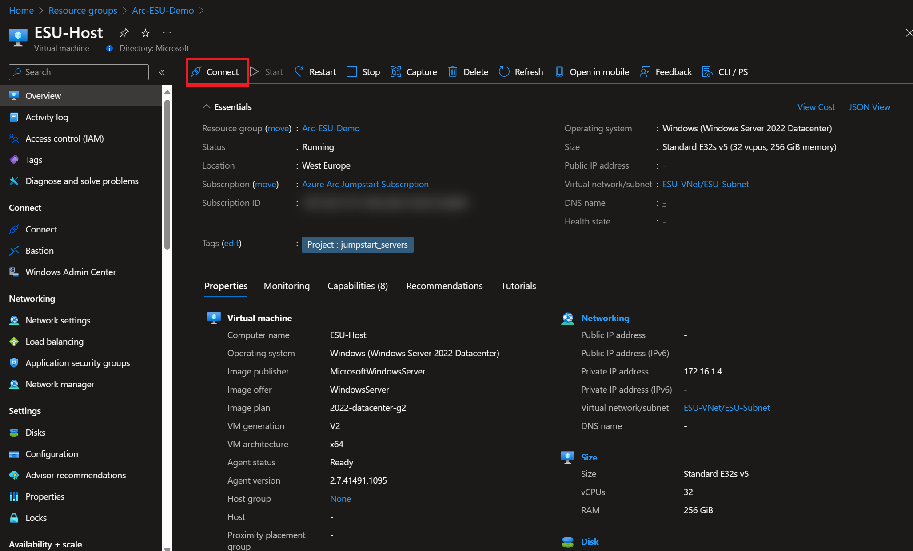

    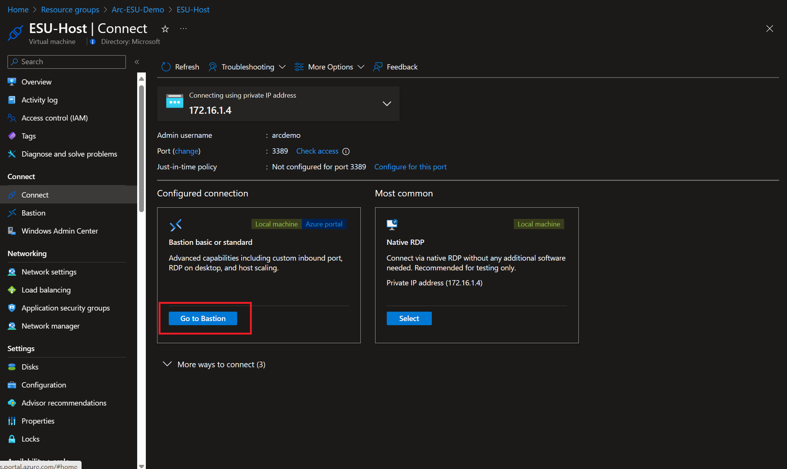

    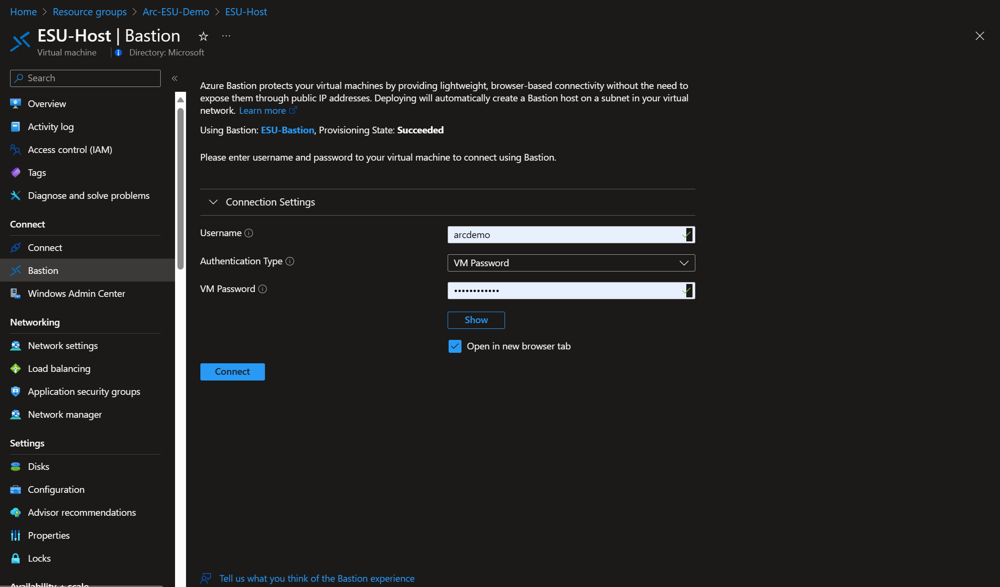

- At first login, as mentioned in the "Automation Flow" section, a logon script will get executed. This script was created as part of the automated deployment process.

    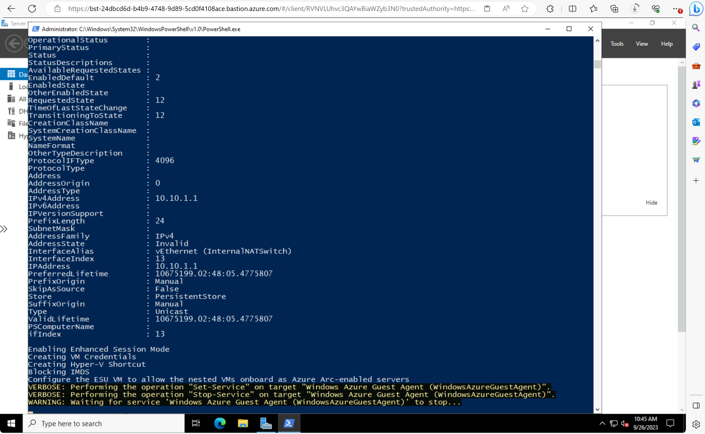

    

    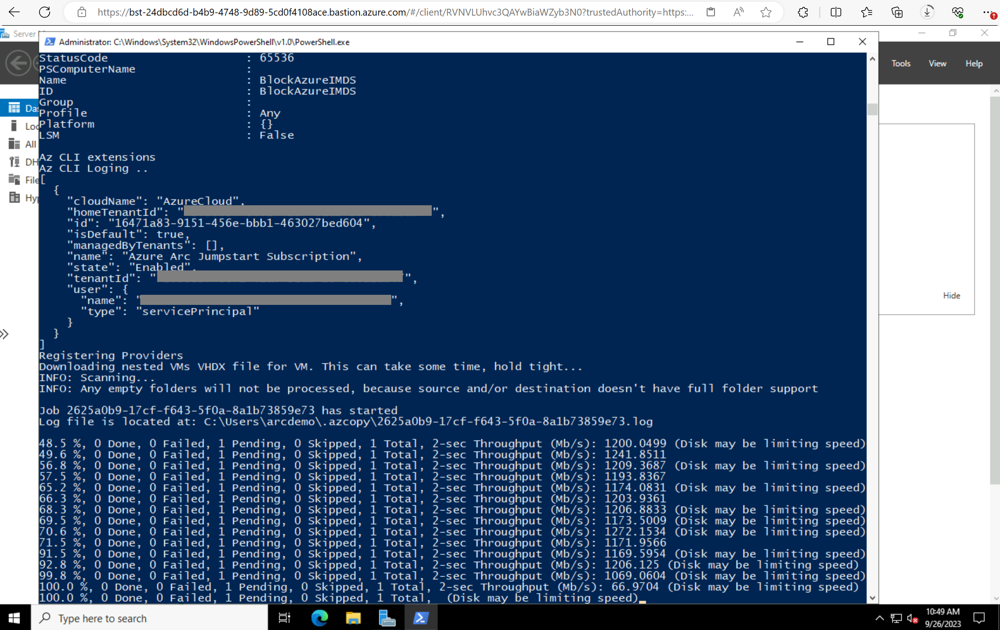

    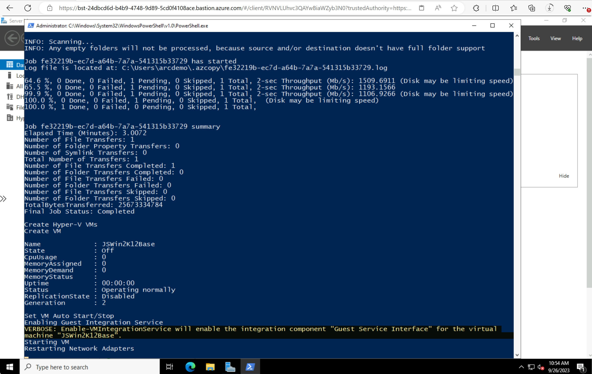

- Let the script to run its course and **do not close** the Powershell session, this will be done for you once completed.

    > **NOTE: The script run time is ~10-15 min long.**

- Upon successful run, a new Azure Arc-enabled server and/or Azure Arc-enabled SQL server will be added to the resource group.

  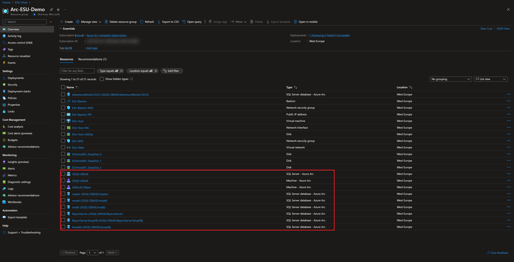

- Now that you have successfully onboarded the Arc-enabled resources, you will be able to manage the Extended Security Updates (ESU) from the Azure Portal:

## Extended Security Updates (ESU)

Now that you have Windows Server 2012 R2 and/or SQL Server 2012 Arc-enabled, you are able to manage ESU licenses for these servers.

- Navigate to the Azure Arc page

  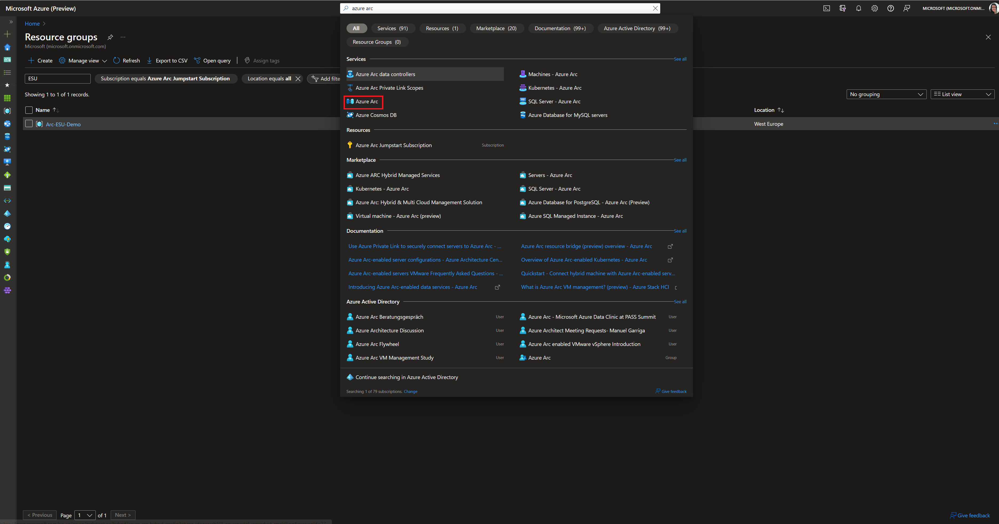

- Select Extended Security Updates in the left pane.

  

- Provision Windows Server 2012 and 2012 R2 Extended Security Update licenses from Azure Arc.

  

  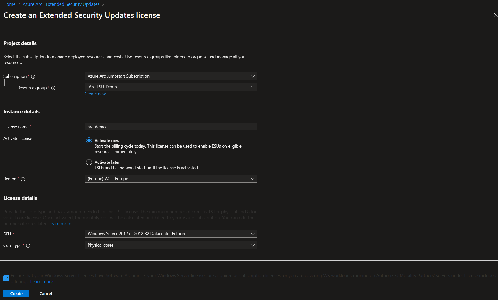

- Select one or more Arc-enabled servers to link to an Extended Security Update license.

  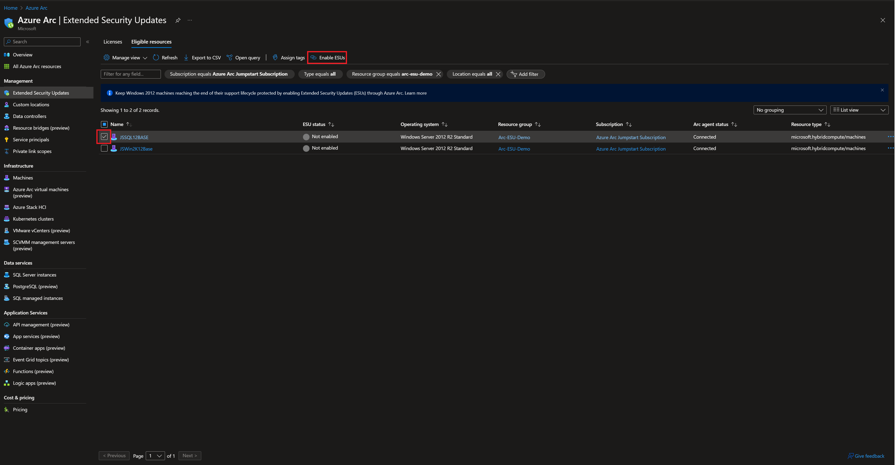

## Clean up environment

Complete the following steps to clean up your environment.

Remove the Azure Resource group from the portal.


